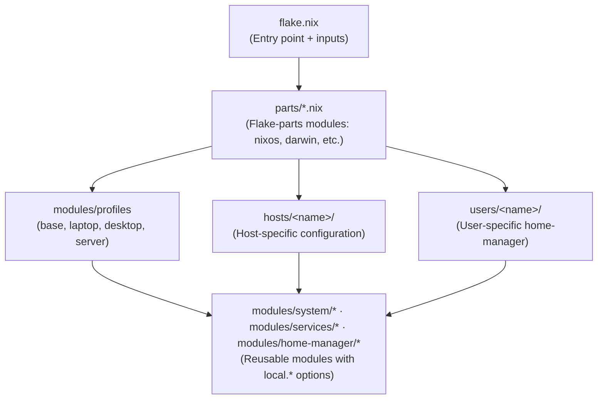
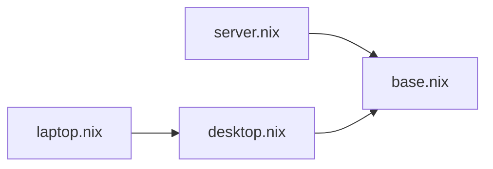

# NixOS Configuration

A modular, multi-platform Nix configuration supporting NixOS, macOS (Darwin), and non-NixOS Linux systems via system-manager.

> **First NixOS Config?** Check out [`examples/minimal/`](./examples/minimal/) for a stripped-down starting point with just one host, one module, and one user.

## Table of Contents

- [Architecture Overview](#architecture-overview)
- [Directory Structure](#directory-structure)
- [Hosts](#hosts)
- [Modules](#modules)
- [Flake Parts](#flake-parts)
- [Users](#users)
- [Commands](#commands)
- [Examples](#examples)

---

## Architecture Overview

This configuration follows a **separation of concerns** pattern where each layer has a specific responsibility:



### Design Philosophy

#### The Override Pattern

A key design principle is **never modifying auto-generated files**. When NixOS generates `configuration.nix` or `hardware-configuration.nix`, those files remain untouched. Instead:

- **`configuration.nix`**: Minimal, imports other files
- **`hardware-configuration.nix`**: Auto-generated, never edited
- **`system-overrides.nix`**: All custom system configuration
- **`hardware-overrides.nix`**: Hardware tweaks that override defaults

**Why?** Running `nixos-generate-config` won't clobber your customizations, and the separation makes it clear what's auto-generated vs. hand-written.

```
hosts/razer14/
├── configuration.nix        # Imports everything, minimal
├── hardware-configuration.nix  # Auto-generated, don't touch
├── hardware-overrides.nix   # Your hardware customizations
└── system-overrides.nix     # Your system configuration
```

#### Simplified Example

For a simple single-host setup, you might have:

```
hosts/
└── my-laptop/
    ├── configuration.nix      # Imports overrides
    ├── hardware-configuration.nix
    └── system-overrides.nix   # All your customizations here
```

---

## Directory Structure

```
~/.nixos/
├── flake.nix                 # Flake entry point
├── flake.lock                # Locked dependencies
├── justfile                  # Command runner (like make)
│
├── parts/                    # Flake-parts modules
│   ├── lib.nix               # Shared utilities & constants
│   ├── nixos.nix             # NixOS configurations
│   ├── darwin.nix            # macOS configurations
│   ├── home-manager.nix      # Standalone home-manager
│   ├── system-manager.nix    # Non-NixOS Linux
│   ├── dev-shells.nix        # Development shells
│   ├── checks.nix            # CI checks
│   └── formatter.nix         # Code formatter
│
├── hosts/                    # Machine-specific configs
│   ├── razer14/              # NixOS laptop
│   ├── dell-plex-server/     # NixOS server
│   ├── reddit-mac/           # macOS (Darwin)
│   └── reddit-framework13-system-manager/  # Non-NixOS Linux
│
├── modules/                  # Reusable modules
│   ├── profiles/             # Role-based profiles
│   ├── system/               # NixOS system modules
│   ├── services/             # Service modules
│   ├── home-manager/         # Home-manager modules
│   ├── mac-services/         # macOS-specific services
│   └── system-manager/       # Non-NixOS system modules
│
├── users/                    # User configurations
│   ├── adriel/               # Personal user
│   └── adriel.velazquez/     # Work user
│
├── dotfiles/                 # Application configs
│   ├── nvim/                 # Neovim configuration
│   ├── kitty/                # Kitty terminal
│   └── kanata/               # Keyboard remapper
│
├── secrets/                  # SOPS-encrypted secrets
│   └── secrets-enc.yaml
│
└── dev-shells/               # Development environments
    └── python.nix
```

---

## Hosts

Each host directory contains the configuration for a specific machine.

### Host Structure

```
hosts/<hostname>/
├── configuration.nix         # Entry point, imports other files
├── hardware-configuration.nix # Generated by nixos-generate-config
├── hardware-overrides.nix    # Hardware customizations (optional)
└── system-overrides.nix      # System configuration
```

### Example: `configuration.nix` (Minimal)

```nix
# hosts/my-laptop/configuration.nix
{ ... }:
{
  imports = [
    ./hardware-configuration.nix
    ./system-overrides.nix
  ];

  networking.hostName = "my-laptop";
  system.stateVersion = "24.05";
}
```

### Example: `system-overrides.nix` (All the good stuff)

```nix
# hosts/my-laptop/system-overrides.nix
{ pkgs, ... }:
{
  # Enable modules via local.* options
  local.cosmic.enable = true;
  local.docker.enable = true;
  local.docker.users = [ "myuser" ];

  # Direct NixOS options
  powerManagement.powertop.enable = true;

  # Packages
  environment.systemPackages = with pkgs; [ vim git ];
}
```

### Available Hosts

| Host | Type | Description |
|------|------|-------------|
| `razer14` | NixOS | Razer Blade 14 laptop (AMD + NVIDIA) |
| `dell` | NixOS | Dell Plex media server |
| `PNH46YXX3Y` | Darwin | Reddit work MacBook |
| `reddit-framework13-system-manager` | system-manager | Framework 13 on Pop!_OS |

---

## Modules

Modules provide reusable, toggleable functionality via `local.*` options.

### Module Categories

```
modules/
├── profiles/          # Role-based defaults (what IS this machine?)
├── system/            # NixOS system-level features
├── services/          # Background services
├── home-manager/      # User-level configuration
├── mac-services/      # macOS-specific
└── system-manager/    # Non-NixOS Linux
```

### Profiles (`modules/profiles/`)

Profiles define what *kind* of system this is. They stack:



| Profile | Includes | Purpose |
|---------|----------|---------|
| `base.nix` | Core settings | Nix config, locale, networking basics |
| `desktop.nix` | base + audio, graphics, bluetooth | GUI systems |
| `laptop.nix` | desktop + power management | Mobile systems |
| `server.nix` | base + headless settings | Servers |

### System Modules (`modules/system/`)

NixOS-level features enabled via `local.<module>.enable`:

| Module | Purpose |
|--------|---------|
| `cosmic.nix` | COSMIC desktop environment |
| `cuda.nix` | NVIDIA CUDA support |
| `kanata.nix` | Keyboard remapping |
| `steam.nix` | Steam gaming |
| `wifi-profiles.nix` | Declarative WiFi networks |
| `mediatek-wifi.nix` | MT7925 WiFi fixes |
| `plex.nix` | Plex media server |

**Usage:**

```nix
# In system-overrides.nix
local.cosmic.enable = true;
local.kanata.enable = true;
local.kanata.devices = [ "/dev/input/by-id/usb-keyboard" ];
```

### Service Modules (`modules/services/`)

Background services:

| Module | Purpose |
|--------|---------|
| `docker.nix` | Docker with user group management |
| `mullvad.nix` | Mullvad VPN |
| `ollama.nix` | Ollama AI (with CUDA support) |

### Home Manager Modules (`modules/home-manager/`)

User-level configuration:

| Module | Purpose |
|--------|---------|
| `zsh.nix` | ZSH shell with plugins |
| `kitty.nix` | Kitty terminal |
| `neovim.nix` | Neovim editor |
| `starship.nix` | Shell prompt |
| `firefox.nix` | Firefox with hardware acceleration |
| `fonts.nix` | Font packages |
| `ssh.nix` | SSH configuration with SOPS keys |
| `sops.nix` | Secrets management |

### Creating a Simple Module

```nix
# modules/system/my-feature.nix
{ lib, config, pkgs, ... }:

let
  cfg = config.local.my-feature;
in
{
  options.local.my-feature = {
    enable = lib.mkEnableOption "my feature";
    
    setting = lib.mkOption {
      type = lib.types.str;
      default = "value";
      description = "A setting";
    };
  };

  config = lib.mkIf cfg.enable {
    environment.systemPackages = [ pkgs.some-package ];
    # Use cfg.setting here
  };
}
```

---

## Flake Parts

This configuration uses [flake-parts](https://flake.parts/) to organize the flake into modular pieces.

### How It Works

```nix
# flake.nix (simplified)
{
  outputs = inputs@{ flake-parts, ... }:
    flake-parts.lib.mkFlake { inherit inputs; } {
      systems = [ "x86_64-linux" "aarch64-darwin" ];
      
      imports = [
        ./parts/nixos.nix
        ./parts/darwin.nix
        ./parts/home-manager.nix
        # ...
      ];
    };
}
```

### Parts Breakdown

| Part | Purpose |
|------|---------|
| `lib.nix` | Shared constants, helper functions |
| `nixos.nix` | Defines `nixosConfigurations` |
| `darwin.nix` | Defines `darwinConfigurations` |
| `home-manager.nix` | Defines standalone `homeConfigurations` |
| `system-manager.nix` | Defines `systemConfigs` for non-NixOS |
| `dev-shells.nix` | Development shells |
| `checks.nix` | CI validation |
| `formatter.nix` | Code formatting |

### Adding a New NixOS Host

```nix
# parts/nixos.nix
{
  flake.nixosConfigurations = {
    my-new-host = mkNixosConfig {
      profile = "laptop";  # or "desktop", "server"
      hostConfig = ../hosts/my-new-host/configuration.nix;
      # Optional: different user
      # username = "myuser";
      # userConfig = ../users/myuser;
    };
  };
}
```

---

## Users

User configurations live in `users/` and are managed by Home Manager.

### Structure

```
users/
├── adriel/
│   └── default.nix      # Complete user config (NixOS)
└── adriel.velazquez/
    ├── default.nix      # macOS config
    ├── linux.nix        # Linux config
    └── modules.nix      # Shared module enables
```

### Example: Simple User Config

```nix
# users/myuser/default.nix
{ pkgs, ... }:
{
  imports = [
    ../../modules/home-manager/default.nix
  ];

  # Home Manager settings
  home.stateVersion = "24.05";
  programs.home-manager.enable = true;
  home.username = "myuser";
  home.homeDirectory = "/home/myuser";

  # Enable modules
  local.zsh.enable = true;
  local.kitty.enable = true;
  local.neovim.enable = true;

  # Packages
  home.packages = with pkgs; [
    ripgrep
    jq
    git
  ];

  # Git
  programs.git = {
    enable = true;
    settings.user.name = "My Name";
    settings.user.email = "me@example.com";
  };
}
```

### Multi-Platform Users

For users on both macOS and Linux:

```
users/myuser/
├── default.nix   # macOS (homeDirectory = /Users/myuser)
├── linux.nix     # Linux (homeDirectory = /home/myuser)
└── modules.nix   # Shared: module enables (imported by both)
```

---

## Commands

Commands are managed via [just](https://just.systems/). Run `just` to see all available commands.

### Quick Reference

```bash
just                  # Show all commands
```

### NixOS

```bash
just switch           # Rebuild current host
just switch razer14   # Rebuild specific host
just test             # Test (reverts on reboot)
just diff             # Show what would change
just rollback         # Rollback to previous generation
```

### macOS (Darwin)

```bash
just darwin-switch    # Rebuild Darwin config
```

### Home Manager

```bash
just home-switch              # Switch home config
just home-activate adriel     # Activate via nix run (no CLI needed)
```

### System Manager (Non-NixOS)

```bash
just system-manager-switch    # Activate system-manager config
```

### Maintenance

```bash
just update           # Update all flake inputs
just gc               # Garbage collect
just gc-older 7       # GC generations older than 7 days
just clean            # Full cleanup (gc + optimize)
just generations      # List generations
```

### Development

```bash
just fmt              # Format all Nix files
just check            # Validate flake
just repl             # Open nix repl with flake
just dev              # Enter dev shell
just dev-python       # Python dev shell
```

### Secrets (SOPS)

```bash
sops-edit             # Edit secrets file
sops-view             # View decrypted secrets
```

---

## Setting up a new machine

### Prerequisites

1. **Enable flakes** (if on fresh NixOS):

```nix
# /etc/nixos/configuration.nix
nix.settings.experimental-features = [ "nix-command" "flakes" ];
```

2. **Install just**:

```bash
nix-shell -p just
```

### Clone and Switch

```bash
git clone https://github.com/yourusername/nixos-config ~/.nixos
cd ~/.nixos

# For NixOS
just switch hostname

# For macOS
just darwin-switch

# For Home Manager only
just home-activate username
```

---

## Examples

See the [`examples/`](./examples/) directory for minimal working examples:

### [`examples/minimal/`](./examples/minimal/)

A stripped-down example with:
- 1 NixOS host (`my-laptop`)
- 1 custom module (`local.hello`)
- 1 user (`myuser`)
- Flake-parts structure

Perfect for understanding the patterns without the complexity of a full multi-host setup.

```bash
cd examples/minimal
nixos-rebuild build --flake .#my-laptop
```

---

## CI/CD

This repository includes GitHub Actions that:

- Build all NixOS configurations on push/PR to main
- Validate flake health
- Run on matrix for parallel builds

See `.github/workflows/check.yml` for details.
